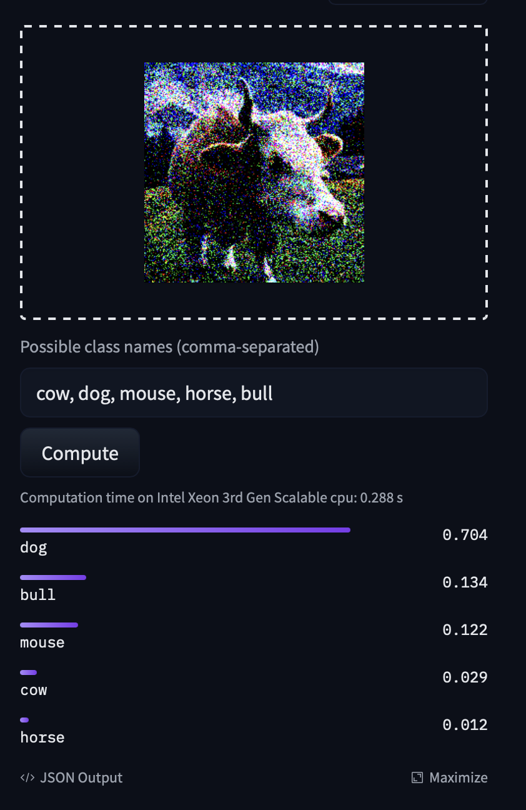

# Implementation of Glaze

[Glaze Paper](https://arxiv.org/abs/2302.04222)

Glaze is a project that seeks to prevent diffusion models from 'learning' art styles. I could not find the source code so implemented it from the paper.

## Progress
WIP

Example of [CLIP](https://huggingface.co/openai/clip-vit-base-patch32) classifing a cow as a dog.
